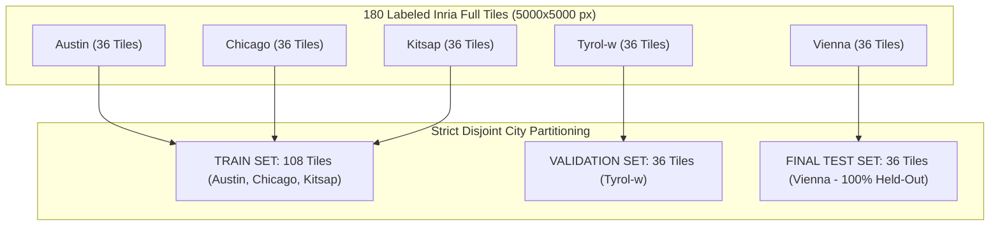

# Part 2 Partitioning Strategy: Strict City-Level Geographic Generalization Protocol

**Assessment:** UNLV PhD Technical Assessment — Dr. Sohn's Research Lab  
**Domain:** Part 2: Building Footprint Semantic Segmentation  
**Document:** Corrected City-Level Geographic Partitioning Protocol & Audit  
**Date:** September 26, 2026

---

## 1. Problem Statement: Spatial & Geographic Leakage Prevention

In high-resolution aerial imagery semantic segmentation ($0.3\text{ m}$ spatial resolution RGB tiles), standard random pixel or patch-level dataset splitting creates catastrophic methodological flaws:

1. **Overlapping Neighboring Patch Leakage:** If $512 \times 512$ sub-patches are randomly assigned to train and validation sets, adjacent or overlapping patches sharing identical building roofs, street shadows, and soil textures will appear in both sets, causing severe target memorization.
2. **Intra-City Tile Boundary Leakage:** If contiguous tiles from the same city are split between training and validation (e.g. Tile 5 in val and Tile 6 in train), neighboring tiles across the boundary share spatial autocorrelation. Without a quantified, meter-level spatial buffer distance established via explicit GIS coordinates, splitting tiles within the same city is methodologically vulnerable.
3. **Geographic Domain Leakage:** Models trained and validated on patches mixed across the same metropolitan area learn city-specific architectural conventions. True model evaluation requires testing on completely unobserved geographic cities.

---

## 2. Labeled Dataset Structure

The audited Inria Aerial Image Labeling dataset consists of **180 labeled full tiles** ($5000 \times 5000$ pixels each), evenly distributed across 5 cities (36 tiles per city):

* **Austin (USA):** 36 tiles (`austin1` to `austin36`)
* **Chicago (USA):** 36 tiles (`chicago1` to `chicago36`)
* **Kitsap County (USA):** 36 tiles (`kitsap1` to `kitsap36`)
* **Tyrol-w (Austria):** 36 tiles (`tyrol-w1` to `tyrol-w36`)
* **Vienna (Austria):** 36 tiles (`vienna1` to `vienna36`)

---

## 3. Strict City-Level Geographic Generalization Strategy

To enforce absolute geographic separation and eliminate same-city tile leakage across partitions, dataset splitting is executed strictly at the **City Level**:

> "Partitioning is performed at the complete 5000×5000 tile/city level before any 512×512 patch extraction. This prevents same-city geographic overlap between training, validation, and final test partitions."



### Partition Allocation Table

| Partition Split | City / Region Assigned | Tile Count | Percentage | Primary Purpose |
| :--- | :--- | :---: | :---: | :--- |
| **Training Set** | **Austin, Chicago, Kitsap** | **108** | 60.00% | Deep learning model training |
| **Validation Set** | **Tyrol-w** | **36** | 20.00% | Hyperparameter selection & early stopping |
| **Final Test Set** | **Vienna (100% Held-Out)** | **36** | 20.00% | Pure geographic domain generalization evaluation |
| **Total** | **5 Cities (Disjoint)** | **180** | **100.0%** | **Full Labeled Inria Dataset** |

---

## 4. Guarantees Provided by This Protocol

This city-level separation protocol provides exact, unassailable guarantees:

1. **No Shared Cities Between Train & Validation:** Train cities ($\{\text{Austin, Chicago, Kitsap}\}$) and Validation city ($\{\text{Tyrol-w}\}$) have zero intersection ($\text{Train} \cap \text{Val} = \emptyset$).
2. **No Shared Cities Between Train & Test:** Train cities and Test city ($\{\text{Vienna}\}$) have zero intersection ($\text{Train} \cap \text{Test} = \emptyset$).
3. **No Shared Cities Between Validation & Test:** Validation city and Test city have zero intersection ($\text{Val} \cap \text{Test} = \emptyset$).
4. **No Same-City Tile Leakage:** Because cities are disjoint across splits, no neighboring tiles from the same city can ever cross train/validation/test boundaries.
5. **Completely Unseen Test City:** Vienna remains 100% untouched during all feature extraction, mini-batch training, and hyperparameter tuning.

---

## 5. Machine-Readable Manifest & Visual Schematic

* **Split Manifest:** Exported to [`outputs/tables/part2_spatial_split_manifest.csv`](file:///d:/UNLV_PhD_Technical_Assessment/outputs/tables/part2_spatial_split_manifest.csv) with columns: `tile_id`, `city`, `split`, `image_path`, `mask_path`, `is_test_city`, `is_validation`, `is_training`.
* **Visual Diagram:** Rendered schematic grid map saved to [`outputs/figures/fig6_spatial_split_schematic.png`](file:///d:/UNLV_PhD_Technical_Assessment/outputs/figures/fig6_spatial_split_schematic.png).

---

## 6. Automated Spatial Leakage Verification

Automated checks implemented in `src/data/check_spatial_leakage.py` verified 100% compliance across all 10 criteria:

```text
================================================================================
AUTOMATED SPATIAL DATA LEAKAGE CHECK REPORT — STATUS: [PASS]
================================================================================
  - Check 1_total_tiles_180: [PASSED] (180 labeled tiles uniquely indexed)
  - Check 2_mutually_exclusive_tiles: [PASSED] (Zero tile ID overlap across splits)
  - Check 3_no_filepath_duplication: [PASSED] (Zero image/mask path duplication)
  - Check 4_train_val_city_intersection_empty: [PASSED] (Train ∩ Val = ∅)
  - Check 5_train_test_city_intersection_empty: [PASSED] (Train ∩ Test = ∅)
  - Check 6_val_test_city_intersection_empty: [PASSED] (Val ∩ Test = ∅)
  - Check 7_vienna_only_in_test: [PASSED] (Vienna strictly in test_city)
  - Check 8_tyrol_only_in_val: [PASSED] (Tyrol-w strictly in validation)
  - Check 9_austin_chicago_kitsap_only_in_train: [PASSED] (Austin/Chicago/Kitsap strictly in train)
  - Check 10_no_patch_extraction_yet: [PASSED] (Patches not generated prematurely)
================================================================================
```

---

## 7. Methodological Limitations & Explicit Disclaimers

> "Because the available dataset files do not expose reliable geographic coordinates in the inspected TIFF metadata, the protocol uses city-level separation rather than claiming a quantified meter-level spatial buffer."

### Scope of Guarantee
* This protocol guarantees **city-level geographic separation**, eliminating all same-city tile and patch leakage across splits.
* It evaluates true cross-region domain transfer (e.g. testing model generalization on European architecture in Vienna after training on US cities and validating on Alpine villages in Tyrol-w).
* **Patch Extraction Audit:** No $512 \times 512$ patches have been cropped yet. Model training has NOT been initiated.

---

### End of Corrected Partitioning Strategy Report
