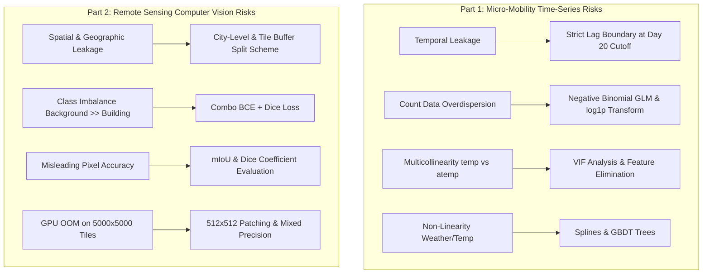

# Technical Implementation Plan: UNLV PhD Assessment
**Department of Civil and Environmental Engineering and Construction**  
**Dr. Sohn's Research Lab | University of Nevada, Las Vegas**

---

## 1. Executive Summary & Assessment Overview

### 1.1 Context and Purpose
This document establishes the comprehensive technical implementation plan for the PhD Technical Assessment submitted to Dr. Sohn’s Research Lab at the University of Nevada, Las Vegas (UNLV). The assessment evaluates advanced data analytics, statistical modeling, time-series forecasting, and computer vision capabilities applied to civil infrastructure and urban mobility domains.

### 1.2 Assessment Metadata
* **Target Recipient:** PhD Applicant Candidate
* **Evaluating Institution:** UNLV Department of Civil and Environmental Engineering and Construction (Dr. Sohn’s Research Lab)
* **Deadline:** September 28, 2026
* **Assessment Document:** [`PhD_Technical_Assessment.pdf`](file:///d:/UNLV_PhD_Technical_Assessment/PhD_Technical_Assessment.pdf)
* **Core Domains:** 
  1. Micro-mobility Demand Forecasting & Statistical Modeling (Capital Bikeshare Dataset)
  2. High-Resolution Remote Sensing & Building Footprint Semantic Segmentation (Inria Aerial Image Labeling Dataset)

---

## 2. Explicit Requirements Extracted from Assessment PDF

### 2.1 Part 1: Capital Bikeshare Demand Analysis & Forecasting
* **Dataset:** UCI Bike Sharing Dataset (`hourly` records spanning 2 years; 17,379 observations).
* **Attributes:** `datetime`, `season` (1:spring, 2:summer, 3:fall, 4:winter), `holiday` (0/1), `workingday` (0/1), `weather` (1 to 4 scale), `temp` (°C), `atemp` (°C), `humidity` (%), `windspeed`, `casual`, `registered`, `count` (`casual + registered`).
* **Task 1 (Descriptive Statistics & EDA):**
  * Explore rental frequencies across time windows (hourly, daily, monthly, seasonal, workingday vs. weekend).
  * Analyze weather conditions impact on demand.
  * Compare behavioral dynamics between casual vs. registered users.
* **Task 2 (Statistical & Regression Analysis):**
  * Regression analysis examining relationships between independent variables (`weather`, `temp`, `workingday`, etc.) and dependent variable (`count`, `casual`, `registered`).
  * Discuss findings, variable selection logic, and identified statistical issues (`multicollinearity`, `non-linearity`, `count data distribution`).
* **Task 3 (Demand Forecasting & Predictive Modeling):**
  * **Strict Data Partitioning:** Training set = Days 1–20 of each month; Test set = Day 21 through end of each month.
  * Target: Total hourly rental count (`count`) for evaluation windows.
  * **Leakage Prevention:** Features must rely strictly on information available prior to each prediction period (preventing lookahead bias and temporal data leakage).
  * Address evaluation metrics, feature engineering strategy, selected model architectures, training setup, and empirical results discussion across evaluation windows.

### 2.2 Part 2: Building Footprint Semantic Segmentation
* **Dataset:** Inria Aerial Image Labeling Dataset (5000×5000 pixel tiles at 0.3m spatial resolution RGB).
* **Coverage:** 5 cities (Austin, Chicago, Kitsap, Tyrol, Vienna).
* **Mask Specs:** Binary mask where `255 = Building Footprint (Foreground)` and `0 = Background`.
* **Required Technical Components:**
  * **Data Partitioning Logic:** Custom split ensuring zero spatial data leakage (preventing overlapping neighboring patches and geographic leakage across cities).
  * **Model Architecture:** Selection and technical justification of segmentation network (e.g., U-Net with pre-trained encoder).
  * **Loss Function Formulation:** Tailored loss for binary segmentation addressing class imbalance (background vs. building) and edge boundary precision.
  * **Evaluation Metrics:** Select metrics beyond simple pixel accuracy (e.g., IoU / Jaccard Index, F1-Score / Dice, Precision, Recall).
  * **Quantitative Evaluation:** Empirical evaluation on held-out test split.
  * **Qualitative Visual & Failure Analysis:** Side-by-side visual comparison (Original aerial image, Ground-truth mask, Predicted mask) detailing successful extractions and explicit failure cases (e.g., small roofs, shadows, occlusions, complex geometries).

### 2.3 Deliverables & Formatting Requirements
1. **Executable Jupyter Notebook (`.ipynb`):**
   * Annotated, end-to-end executable code covering Part 1 (Data loading, EDA, regression, time-series forecasting pipeline) and Part 2 (Spatial partitioning, patch generation, model training, metric computation, predicted mask visualization).
2. **Research Summary Report (`.pdf`):**
   * Concise technical memorandum presenting statistical findings, regression tables, time-series metrics, spatial partitioning logic, architecture/loss choices, quantitative test results, and visual error analysis.

---

## 3. Technical Decisions to be Made (Unprescribed Choices)

Because the professor left specific implementation nuances open, the following technical choices will be made and rigorously justified:

| Category | Decision Area | Selected Technical Approach | Technical Justification |
| :--- | :--- | :--- | :--- |
| **Part 1: Modeling** | Regression Distribution | Negative Binomial GLM & Log-Transformed OLS (`log1p(count)`) | `count` is non-negative, right-skewed, overdispersed data. Standard OLS on raw `count` predicts negative values and violates homoscedasticity. |
| **Part 1: Forecasting** | Models & Metrics | LightGBM / XGBoost Regressor + RMSLE, MAE, RMSE, $R^2$ | GBDT handles non-linear weather interactions and temporal seasonality naturally. RMSLE penalizes relative prediction errors and handles scale variance. |
| **Part 1: Features** | Feature Pipeline | Calendar cyclical encodings ($\sin/\cos$ hour/month), lag features strictly bounded by day 20, exponential rolling stats | Prevents lookahead bias while capturing strong 24-hour diurnal and 7-day weekly periodicities. |
| **Part 2: Split Scheme** | Spatial Partitioning | City-Level Domain Split + Tile Grid Buffer Split | Holds out entire geographic areas (e.g., 1 city for pure geographic generalization test) and uses buffered tile splits for intra-city val set to guarantee no spatial overlap. |
| **Part 2: Architecture** | Model Choice | U-Net with ResNet34 / EfficientNet-B0 Backbone (Pretrained ImageNet) | Strong multi-scale feature retention via skip connections; pretrained encoder speeds up convergence on limited spatial data. |
| **Part 2: Loss Function** | Loss Formulation | Combined Binary Cross-Entropy (BCE) + Soft Dice Loss | BCE handles smooth pixel-wise gradients; Dice Loss directly optimizes boundary alignment and overcomes pixel class imbalance. |
| **Part 2: Metrics** | Evaluation Protocol | Mean IoU (Jaccard Index), F1 / Dice Score, Boundary IoU, Precision, Recall | Pixel accuracy is misleading when background dominates (~80%+ of pixels). IoU and F1 measure actual building overlap quality. |
| **Part 2: Patch Strategy**| Image Preprocessing | 512×512 uniform patch cropping with 0% overlap across train/val boundary | 5000×5000 full tiles cannot fit into GPU memory; 512×512 maintains spatial context while enabling efficient mini-batching. |

---

## 4. Methodological Risks and Mitigation Strategies



### 4.1 Detailed Risk Assessment Matrix

#### 1. Temporal Data Leakage (Part 1)
* **Risk:** Constructing lag features (e.g., $t-1$, $t-24$) or rolling averages across the day 20 to day 21 boundary using actual test-set ground truth count values.
* **Mitigation:** Enforce a strict chronological pipeline cutoff. For test set predictions (days 21+), rolling features must strictly use lagged values available up to day 20, or multi-step autoregressive recursive forecasting where model predictions are fed back as lags.

#### 2. Spatial & Geographic Data Leakage (Part 2)
* **Risk:** Randomly splitting cropped 512×512 patches across train/test sets causes neighboring patches (sharing edge buildings/streets) to appear in both sets, inflating evaluation metrics artificially.
* **Mitigation:** Partition at the **Tile Level** (5000×5000) or **City Level**. For example, set aside 20% of full tiles (or an entire city like Chicago/Vienna) exclusively for evaluation before any patch cropping occurs.

#### 3. Count-Data Distribution & Zero-Inflation (Part 1)
* **Risk:** Bikeshare hourly counts are non-negative integer data exhibiting overdispersion ($\text{Var}(Y) \gg \mathbb{E}[Y]$) and right-skewness. OLS regression assumes Gaussian homoscedastic errors, leading to negative count predictions and invalid p-values.
* **Mitigation:** Implement Poisson and Negative Binomial Generalized Linear Models (GLMs). Apply a logarithmic target transformation $y^* = \ln(\text{count} + 1)$ for regression and evaluation via RMSLE.

#### 4. Multicollinearity (Part 1)
* **Risk:** High correlation between `temp` and `atemp` ($r > 0.98$), as well as collinear seasonal/monthly dummy indicators, unstable regression coefficients, and inflated standard errors.
* **Mitigation:** Calculate Variance Inflation Factors (VIF). Drop redundant variables (e.g., remove `atemp` in favor of `temp`, or use temperature differential `atemp - temp`).

#### 5. Non-Linearity & Complex Interactions (Part 1)
* **Risk:** The relationship between temperature/windspeed and bike demand is non-linear (e.g., demand peaks around 25°C and drops at extreme heat/cold). Linear regression fails to capture these threshold effects.
* **Mitigation:** Use polynomial terms, Generalized Additive Models (GAMs) / B-splines, and tree-based ensembles (LightGBM/XGBoost) capable of modeling complex interaction boundaries.

#### 6. Class Imbalance in Semantic Segmentation (Part 2)
* **Risk:** Aerial imagery is dominated by background pixels (roads, trees, grass, water), with buildings comprising a minor fraction of overall pixels (~15-25%). Models trained on standard Cross-Entropy tend to predict background everywhere.
* **Mitigation:** Formulate a composite loss function combining Weighted Binary Cross-Entropy and Soft Dice Loss / Focal Loss, directly optimizing overlap rather than raw pixel accuracy.

#### 7. Inappropriate Evaluation Metrics (Part 1 & Part 2)
* **Risk:** Using standard Accuracy in segmentation masks yields >80% accuracy even for a dummy model predicting all background. In time-series, RMSE penalizes large absolute errors on peak hours disproportionately compared to off-peak hours.
* **Mitigation:** 
  * Part 1: Primary evaluation metric = **RMSLE** (Root Mean Squared Logarithmic Error) and **MAE**.
  * Part 2: Primary evaluation metrics = **Mean Intersection over Union (mIoU / Jaccard)** and **Dice Coefficient (F1-Score)**.

---

## 5. High-Quality & Time-Efficient Workflow

```mermaid
gantt
    title PhD Technical Assessment Execution Roadmap
    dateFormat  YYYY-MM-DD
    section Phase 1: Planning
    Task 1.1: Assessment Plan & Document Creation (ASSESSMENT_PLAN.md) :done, p1, 2026-09-26, 1d
    section Phase 2: Data Pipeline & Environment
    Task 2.1: Data Download & Integrity Check (UCI Bike & Inria Aerial) : p2, 2026-09-27, 1d
    Task 2.2: Spatial & Temporal Pipeline Setup : p2_1, 2026-09-27, 1d
    section Phase 3: Execution Part 1
    Task 3.1: EDA & Visualization (Bikeshare) : p3_1, 2026-09-27, 1d
    Task 3.2: Statistical Regression & VIF Diagnostics : p3_2, 2026-09-27, 1d
    Task 3.3: Time-Series Feature Engineering & Forecasting Models : p3_3, 2026-09-27, 1d
    section Phase 4: Execution Part 2
    Task 4.1: Inria Spatial Partitioning & Patch Generation : p4_1, 2026-09-27, 1d
    Task 4.2: U-Net Model Architecture & Loss Setup : p4_2, 2026-09-28, 1d
    Task 4.3: Training, Quantitative Metrics & Failure Visualization : p4_3, 2026-09-28, 1d
    section Phase 5: Synthesis & Reports
    Task 5.1: Executable Notebook Finalization (.ipynb) : p5_1, 2026-09-28, 1d
    Task 5.2: Research Summary PDF Compilation (.pdf) : p5_2, 2026-09-28, 1d
```

---

## 6. Prioritized Requirements Matrix

| Prioritization Level | Part 1: Micro-Mobility Analysis | Part 2: Building Segmentation | Deliverables & Infrastructure |
| :--- | :--- | :--- | :--- |
| **MUST HAVE** | • Complete EDA across temporal/weather windows.<br>• Casual vs. Registered user dynamics.<br>• OLS & Negative Binomial Regression.<br>• VIF Multicollinearity analysis.<br>• Train/Test Split (Days 1–20 vs 21+).<br>• RMSLE/MAE/RMSE evaluation.<br>• GBDT forecasting model. | • Zero-leakage Spatial Tile Partitioning.<br>• 512×512 Patching Pipeline.<br>• U-Net Architecture Implementation.<br>• BCE + Dice Loss Formulation.<br>• mIoU & Dice/F1 Metric Calculation.<br>• Quantitative Evaluation Table.<br>• Qualitative Visual Comparisons. | • Fully annotated Executable `.ipynb`<br>• Clean, publication-quality `.pdf` Research Summary Report.<br>• Fully reproducible seed & directory structure. |
| **SHOULD HAVE** | • Hourly cyclical features ($\sin/\cos$).<br>• Residual diagnostics (QQ-plots, homoscedasticity tests).<br>• Casual & Registered separate forecast sub-models.<br>• Feature Importance Analysis (SHAP). | • Pretrained ResNet34 Encoder.<br>• Boundary IoU metric computation.<br>• Explicit Categorized Failure Analysis (Shadows, Small Roofs, Vegetation).<br>• Data augmentation (Flips, Rotations). | • Publication-grade PDF formatting (styled tables, clear typography).<br>• Automated data downloader scripts. |
| **NICE TO HAVE** | • Hybrid Prophet / ARIMA baseline comparison.<br>• Weather interaction term sensitivity plots. | • Multi-architecture benchmark (U-Net vs. DeepLabV3+).<br>• Hard negative mining / Focal loss hyperparameter tuning. | • Interactive HTML visualizer for segmentation masks. |

---

## 7. Proposed Jupyter Notebook Structure (`.ipynb`)

The Jupyter Notebook will serve as the primary executable code deliverable, formatted cleanly with clear markdown headings, LaTeX formulas, code comments, and inline graphics:

```text
notebooks/UNLV_PhD_Technical_Assessment.ipynb
├── 1. Environment Setup & Reproducibility (Imports, Seeds, GPU check)
├── 2. Part 1: Capital Bikeshare Demand Analysis & Forecasting
│   ├── 2.1 Data Ingestion & Integrity Verification
│   ├── 2.2 Exploratory Data Analysis (EDA)
│   │   ├── 2.2.1 Temporal Patterns (Hourly, Day-of-Week, Monthly)
│   │   ├── 2.2.2 Weather Impact Dynamics
│   │   └── 2.2.3 Casual vs. Registered User Behavior Comparative Analysis
│   ├── 2.3 Statistical & Regression Analysis
│   │   ├── 2.3.1 Variable Selection & VIF Multicollinearity Analysis
│   │   ├── 2.3.2 Model Formulation (OLS vs. Log-OLS vs. Negative Binomial GLM)
│   │   └── 2.3.3 Residual Diagnostics & Statistical Interpretation
│   └── 2.4 Time-Series Forecasting Pipeline (Task 3)
│       ├── 2.4.1 Chronological Partitioning (Days 1–20 Train vs 21+ Test)
│       ├── 2.4.2 Leakage-Free Feature Engineering (Lags, Rolling Stats, Cyclical)
│       ├── 2.4.3 Model Training (LightGBM / XGBoost / Baseline)
│       └── 2.4.4 Empirical Forecasting Evaluation across Evaluation Windows
└── 3. Part 2: Building Footprint Semantic Segmentation
    ├── 3.1 Dataset Ingestion & Metadata Parsing (Inria Dataset)
    ├── 3.2 Leakage-Free Spatial Data Partitioning (City/Tile Level Splits)
    ├── 3.3 Patch Extraction Pipeline & PyTorch Dataset/DataLoader
    ├── 3.4 Model Architecture Definition & Justification (U-Net + ResNet Backbone)
    ├── 3.5 Custom Loss Function Implementation (BCE + Soft Dice Loss)
    ├── 3.6 Model Training Protocol & Validation Monitoring
    ├── 3.7 Quantitative Performance Evaluation (mIoU, Dice, Precision, Recall)
    └── 3.8 Qualitative Visual Assessment & Categorized Failure Case Analysis
```

---

## 8. Proposed Research Summary PDF Structure (`.pdf`)

The Research Summary Report will be structured as an academic/technical memorandum presenting key methodology, tables, figures, and insights:

```text
Research_Summary_Report.pdf (Estimated: 6–8 Pages)
├── Title & Header: UNLV PhD Technical Assessment Memorandum
├── Section 1: Executive Overview & Methodological Framework
├── Section 2: Part 1 — Capital Bikeshare Statistical Analysis & Forecasting
│   ├── 2.1 Exploratory Insights & User Dynamics (Casual vs. Registered)
│   ├── 2.2 Regression Modeling Results & Diagnostic Tables (OLS, NegBin, VIF)
│   └── 2.3 Time-Series Demand Predictive Performance (RMSLE, MAE, Feature Rankings)
├── Section 3: Part 2 — Building Footprint Semantic Segmentation
│   ├── 3.1 Spatial Data Partitioning & Leakage Prevention Strategy
│   ├── 3.2 Deep Learning Architecture & Loss Function Formulation
│   ├── 3.3 Quantitative Segmentation Metrics Table (mIoU, Dice, Precision, Recall)
│   └── 3.4 Qualitative Visual Analysis & Categorized Failure Case Study
└── Section 4: Concluding Synthesis & Relevance to Smart Infrastructure Research
```

---

## 9. Scientific Integrity & Data Policy Commitment

1. **No Fabrication of Results:** No empirical metrics, performance tables, regression coefficients, loss values, or visual segmentation figures will be fabricated or guessed prior to execution.
2. **Post-Execution Data Population:** All numerical tables and figures in both the Jupyter Notebook and Research Summary Report will be directly compiled from live runtime execution logs and model outputs.
3. **Reproducibility Guarantee:** All code will use fixed random seeds (`seed=42`) across NumPy, PyTorch, and GBDT models to ensure exact execution reproducibility.

---

### End of Implementation Plan
*This plan is ready for review and will serve as the blueprint once execution begins.*
